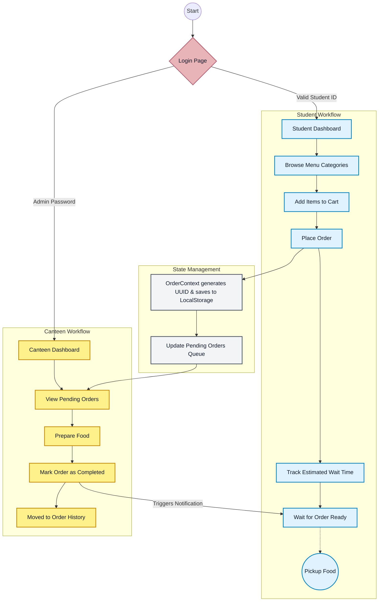

# Smart Canteen System Workflow

### Explanation of the Flow:
1. **Authentication**: Users log in. Based on their credentials, they are routed to either the Student Dashboard or the Canteen Dashboard.
2. **Student Ordering**: Students browse the menu, add items to their cart, and place an order.
3. **State Management**: The application saves the order with a unique ID into the browser's local storage and updates the global state.
4. **Canteen Fulfillment**: The order appears in real-time on the Canteen Dashboard. Staff prepares the food and marks it as complete.
5. **Notification**: Marking the order as complete updates the system, which automatically notifies the student that their food is ready for pickup.
